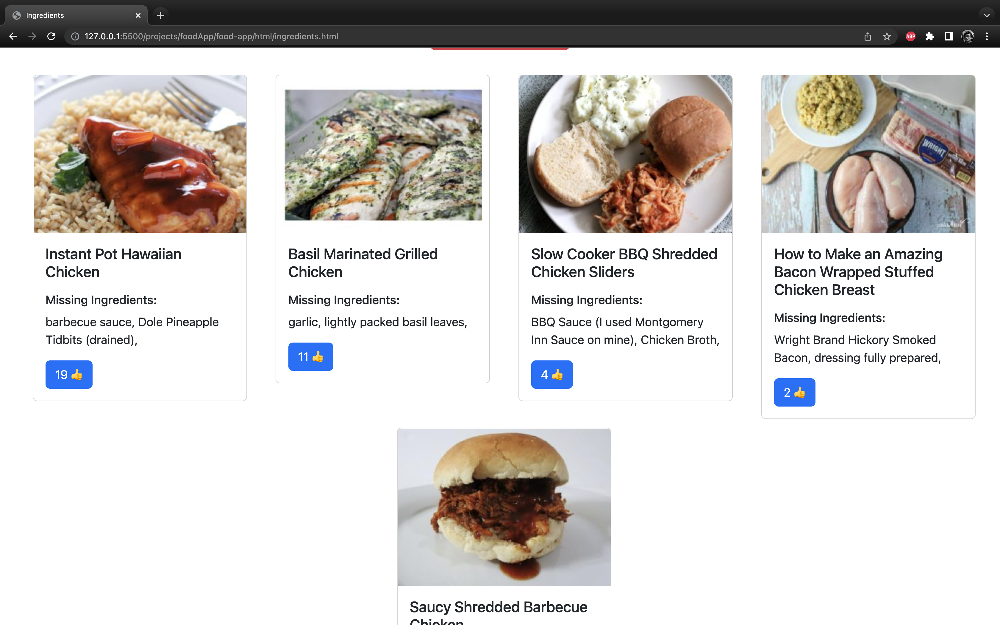
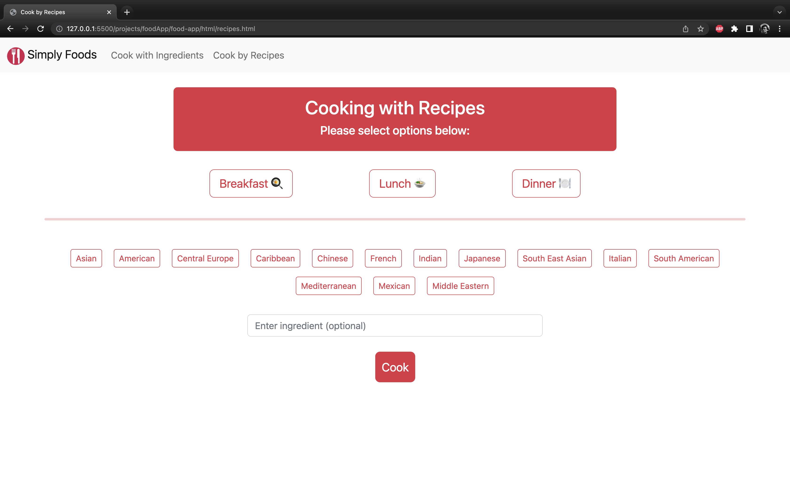

# Simply Foods

## Website Link
Visit [Simply Foods](https://astounding-pasca-d48b68.netlify.app/index.html)!

## About
Simply Foods is a handy little web app that helps you decide what to cook. Get recommendations one of two ways: either provide ingredients you want to use or search for recipes of the cuisine and meal type that you want. Either way, you'll get a selection of delicious meals for you to chef it up!
### Greeting Page
The home page includes a responisive navigation bar that allows you to enter the two pages that are linked. Underneath the navigation bar, you are greeted with a cooking quote by the Italian Chef, Giada De Laurentiis. Giada is known for her cookbooks and appearences on the Food Network.
### Cook with Ingredients
The Cook with Ingredients page will allow the user to enter up to 5 ingredients that they would like to cook with. Once the user us happy with their current ingredients in the pantry section. There is a button "What can I make?" to show suggestions of meals based on the current pantry ingredients.
### Cook with Recipes
The Cook with Recipes page prompts the user to select one category from each section, with an optional input to search for specific ingredients. The user must have both meal type and cuisine type entered for suggestions to show.

## Technologies Used
- Programming languages: HTML, CSS, JavaScript
- JavaScript library: jQuery UI
- CSS styling: Bootstrap
- APIs: Spoonacular, Edamame
- Deployment site: Netlify

## Screenshots of Simply Foods

## Software Development Team
- An Nguyen
-
- Carlos Hernandez
- 
- Jorge Rodriguez
